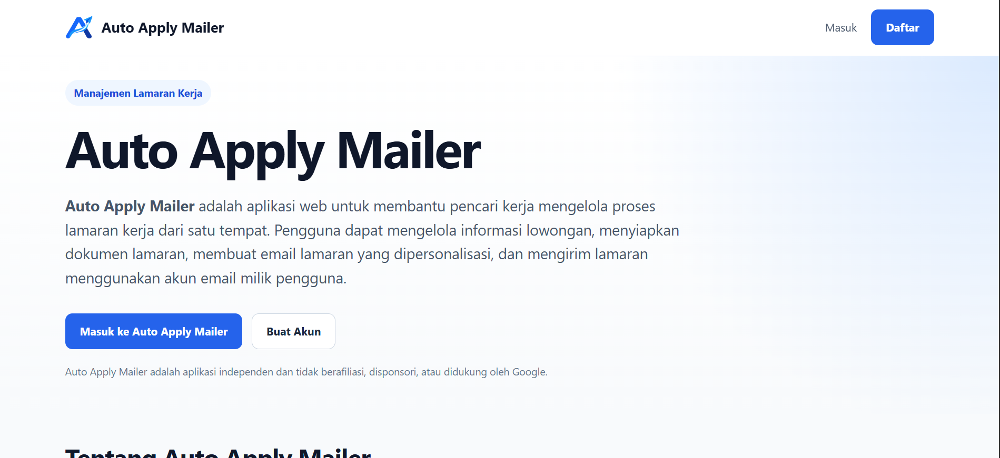
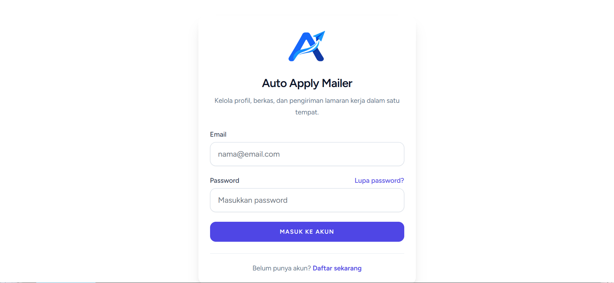
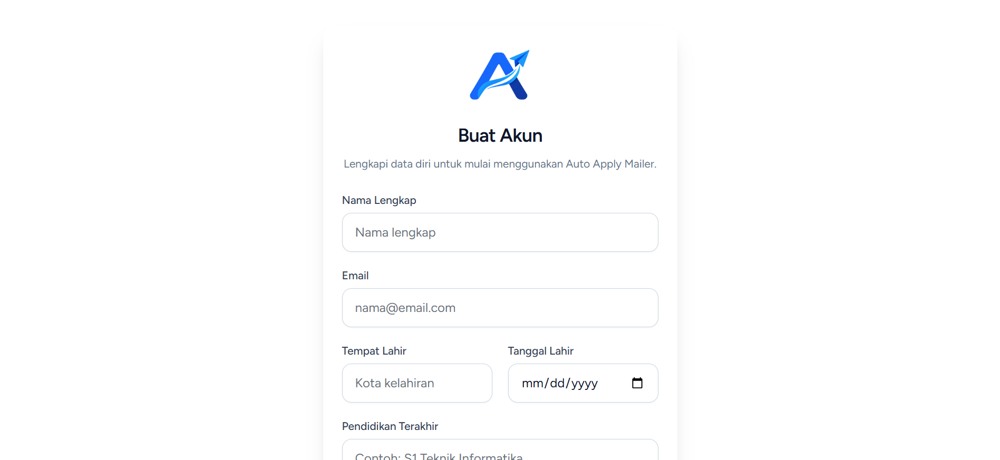
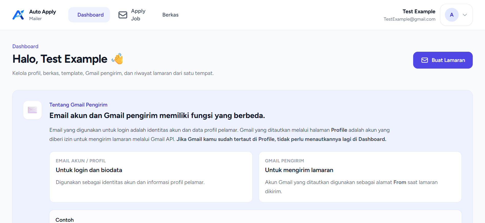
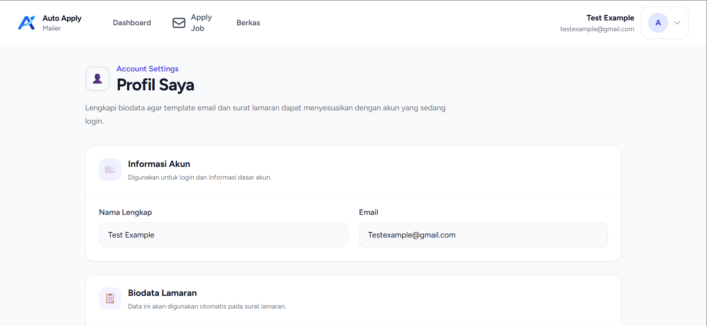
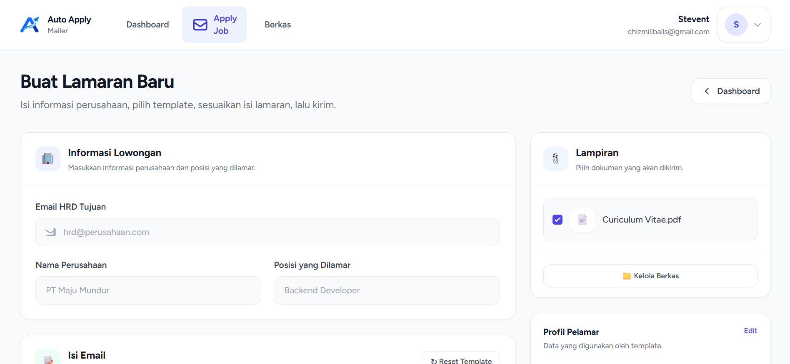
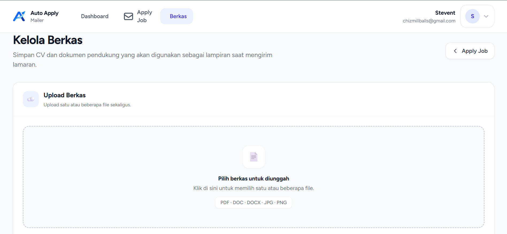
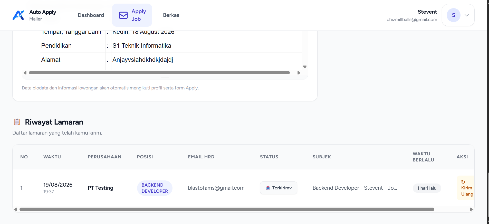

# Auto Apply Mailer

**Auto Apply Mailer** adalah aplikasi web untuk membantu pencari kerja mengelola proses lamaran kerja dari satu tempat.

Pengguna dapat mengelola profil dan biodata, menyimpan dokumen lamaran, menyiapkan email lamaran, mengirim lamaran melalui akun Gmail yang terhubung, serta melihat riwayat lamaran yang telah dikirim.

## Fitur Utama

- Landing page untuk memperkenalkan aplikasi
- Registrasi dan login akun
- Pengelolaan profil dan biodata pelamar
- Pengelolaan berkas/CV dan dokumen pendukung
- Form pembuatan lamaran baru
- Pemilihan lampiran saat mengirim lamaran
- Template dan isi email lamaran
- Pengiriman lamaran menggunakan Gmail pengirim yang terhubung
- Riwayat lamaran yang telah dikirim
- Status dan informasi pengiriman lamaran

## Tampilan Aplikasi

### Homepage

Halaman awal yang menjelaskan fungsi utama Auto Apply Mailer dan menyediakan akses untuk masuk atau membuat akun.



### Login

Halaman login untuk masuk ke akun Auto Apply Mailer.



### Register

Halaman pendaftaran akun baru.



### Dashboard

Dashboard menjadi pusat pengelolaan profil, berkas, Gmail pengirim, template, dan riwayat lamaran.



### Profile

Halaman profil digunakan untuk melengkapi biodata yang nantinya dapat digunakan secara otomatis pada template email dan surat lamaran.



### Apply Job

Halaman pembuatan lamaran baru. Pengguna dapat memasukkan email HRD, nama perusahaan, posisi yang dilamar, memilih lampiran, dan menyesuaikan isi lamaran.



### File Manager / Berkas

Halaman pengelolaan dokumen yang akan digunakan sebagai lampiran lamaran, seperti CV dan dokumen pendukung lainnya.



### History / Riwayat Lamaran

Riwayat menampilkan daftar lamaran yang telah dikirim, termasuk waktu, perusahaan, posisi, email HRD, status, subjek, dan aksi pengiriman ulang.



## Alur Penggunaan

```text
Buat Akun
   ↓
Lengkapi Profil
   ↓
Upload CV / Dokumen
   ↓
Buat Lamaran
   ↓
Isi Informasi Perusahaan & Posisi
   ↓
Pilih Lampiran
   ↓
Sesuaikan Isi Email
   ↓
Kirim Lamaran
   ↓
Pantau Riwayat & Status
```

## Struktur Fitur

| Modul | Fungsi |
| --- | --- |
| Homepage | Informasi dan pengenalan aplikasi |
| Authentication | Registrasi dan login pengguna |
| Dashboard | Pusat pengelolaan aplikasi |
| Profile | Biodata dan informasi akun pelamar |
| Berkas | Upload dan pengelolaan dokumen |
| Apply Job | Membuat dan mengirim lamaran |
| Gmail Pengirim | Akun Gmail yang digunakan untuk pengiriman |
| Riwayat Lamaran | Melihat dan mengelola lamaran yang telah dikirim |

## Catatan

Auto Apply Mailer menggunakan akun email pengguna untuk proses pengiriman lamaran. Pastikan akun pengirim dan konfigurasi yang diperlukan sudah disiapkan sebelum melakukan pengiriman.

## Screenshot

Seluruh screenshot pada README ini disimpan di:

```text
docs/screenshots/
├── homepage.png
├── login.png
├── register.png
├── dashboard.png
├── profil.png
├── apply.png
├── file-manager.png
└── history.png
```

## Lisensi

Silakan sesuaikan bagian lisensi ini dengan lisensi yang digunakan pada repository.
